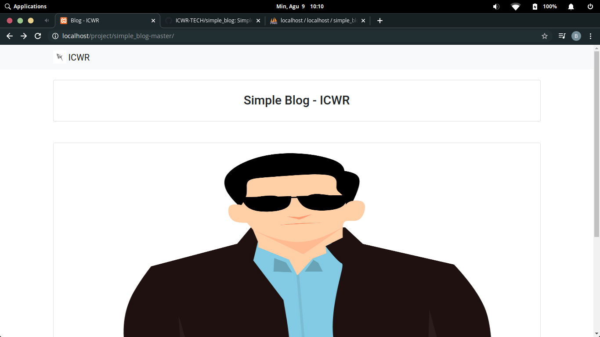
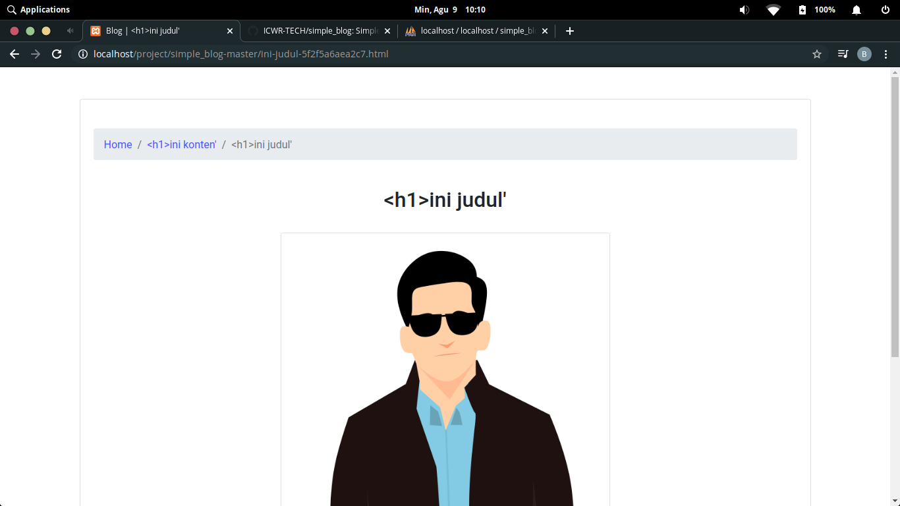
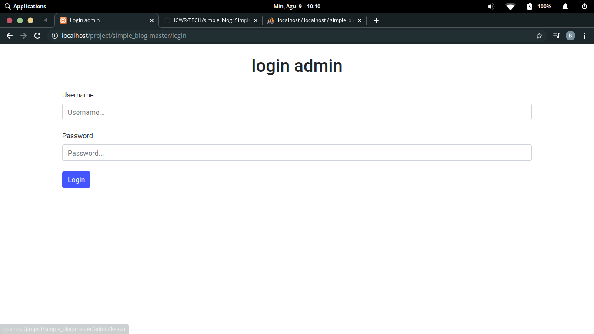
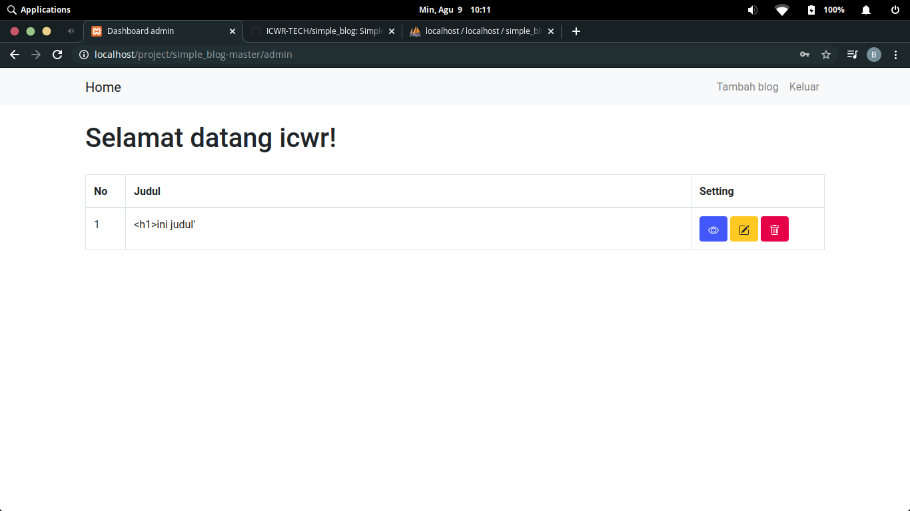
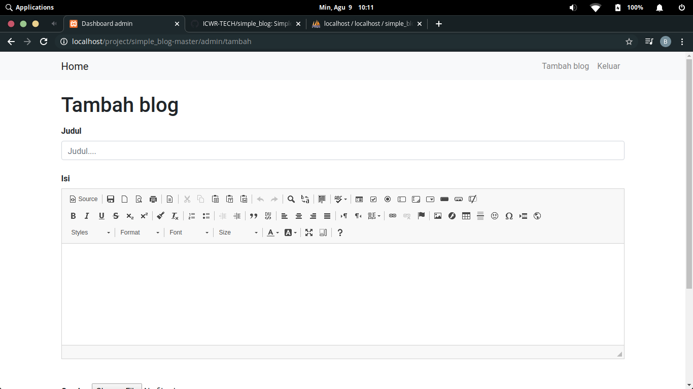

# simple_blog
<br>
Blog sederhana | ICWR
<br>

# Dibuat dari
```
1. PHP Native
2. Framework Codeigniter
3. Bootstrap
4. CSS
5. Jquery
6. JavaScript
```

# Fitur
```
A) Admin
  1. Tambah blog
  2. Sunting blog
  3. Hapus blog
  4. View blog
  5. Logout admin
  6. Login admin
  dll
B) Selain admin
  1. Lihat blog semuanya
  2. Lihat berita berdasarkan judul
  dll
```

# Cara upload di hosting/localhost

```
1. Download simple_blog pada github ICWR

2. Ubah codingan config.php pada folder application > config > config.php
   Ubah $config['base_url']="http://localhost/project/simple_blog" Menjadi $config['base_url']="menjadi direktori anda"
   
3. Ubah codingan database.php pada folder application > config > database.php
   Ubah array hostname,username,password,database sesuai milik anda
   
4. Import databasenya di phpmyadmin filenya ada di document root codeigniternya "simple_blog.sql"

5. Dah selesai blog siap digunakan.
```

# Dir Admin

```
[path]/login

Username = icwr
Password = icwr

Note= jangan lupa diganti username dan passwordnya ya :)

```

# Screenshots

<br>

<br>

<br>

<br>

<br><br>
Mohon maaf kali ini saya tidak memberi demo.
<br>
Bila ada kesalahan mohon dimaklumi:)
<br>
Terimakasih.
